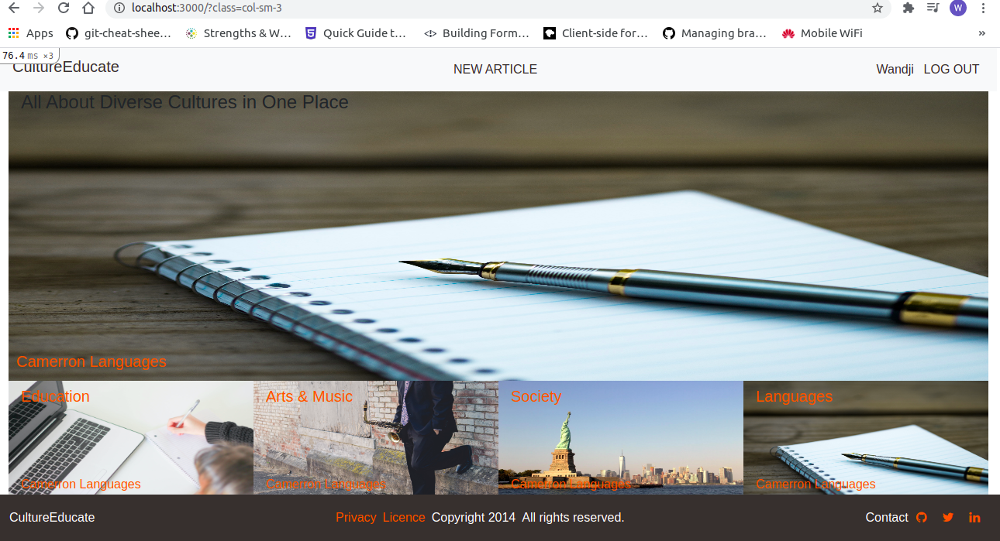
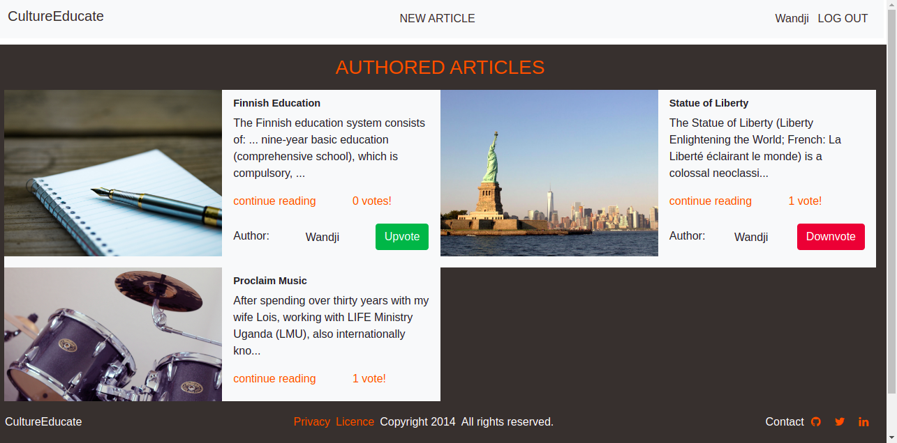
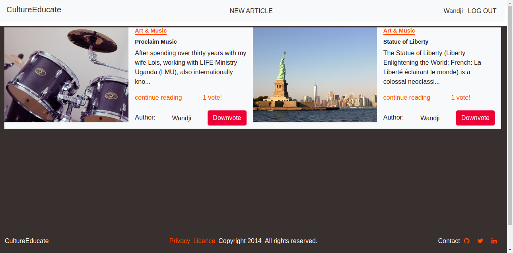
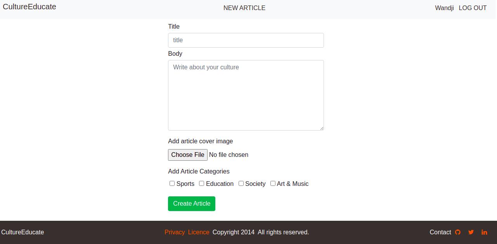

# Culture-Educate

## App screenshot






## [Presentation Project Video](https://www.loom.com/share/4e44ed7848344fd182e383c0f5a73ade)

## [Presentation Project Video](https://www.loom.com/share/cfa58d9b4c5f4da1aceba2f32e1d627a)

## About

Culture-Educate is a rails App built on the basis of Ruby on Rails Evaluation in Microverse school for remote developers. When signed_in on Culture-Educate, the user can see all created articles classified by categories. Also, the signed_in user can create an article, upvote, and downvote a voted article

## Live Link

[Culture-Educate](https://culture-educate-wandji.herokuapp.com/)

## Built With

- Ruby v3.1.3
- Ruby on Rails v6.1.3
- PostgreSQL
- Bootstrap
- Rspec
- Capybara
- Rubocop
- VS Code
- Heroku
- Cloudinary

## Getting Started

To get a local copy up and running follow these simple example steps:

- Fork this project
- Open your terminal
- Clone this project `git clone https://github.com/wandji20/Culture-Educate.git`
- Go to the project folder `cd Culture-Educate`

### Prerequisites

- Ruby: 3.1.3
- Rails: 6.1.3
- Postgres

### Setup

Instal gems with:

```
  bundle
```

Instal yarn and webpacker with:

```
  yarn install
  rails webpacker:install
```

Setup database with:

```
   rails db:create
   rails db:migrate
```

### Drive local host

Start server with:

```
    rails server
```

Open `http://localhost:3000/` in your browser.

### Run tests

- Open terminal
- Run tests `rspec`

## Author

👤 **Wandji Bertrand**

- Github: [@wandji20](https://github.com/wandji20)
- Twitter: [@wandjibertrand](https://twitter.com/wandjibertrand)
- Linkedin: [Linkedin](https://www.linkedin.com/in/wandji-bertrand/)

## 🤝 Contributing

Contributions, issues and feature requests are welcome!

Feel free to check the [issues page](https://github.com/wandji20/Culture-Educate/issues/3).

## Show your support

Give a ⭐️ if you like this project!

## Acknowledgments

- Microverse
- [Nelson Sakwa](https://www.behance.net/sakwadesignstudio)

## 📝 License

[MIT License](./license.txt)
